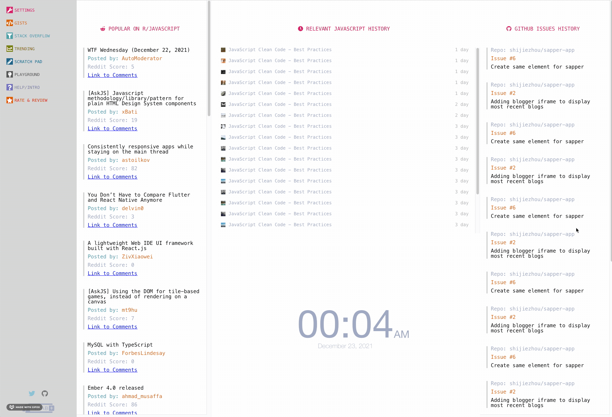

# SOLOPROJECT-TIER1-INITAB-CLONE

A web version of the initab chrome extension like chrome.init

Demo link <a href="https://cloneinitab.netlify.com" target="_blank">HERE</a>
# Install

Node > 6
Npm > 12

```bash
npm i
```

```base
npm run serve
```

# Overview

