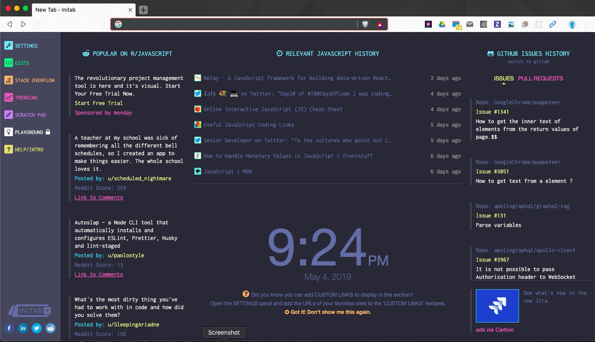

# Chingu Voyage Solo Project (Tier 1): Initab Clone

## Overview
This project tests your CSS, HTML, and Javascript skills as you create a 
clone of the popular [Initab Chrome Extension](). In this project you will 
create a web page that matches the format of this extensions display. 

Initab has a complex layout and completing this project will let you refine
your skills implementing complex, information rich web pages.

You do *_NOT_* implementing a Chrome Extension. Simply a web page that mimics
the initial Initab display.  

## Instructions

For this project you MUST use **vanilla** (plain) HTML/CSS and JavaScript. 
You are encouraged to use CSS grid, flexbox, media queries, a naming system 
like BEM, semantic HTML tags, or other modern techniques. You may not use 
frameworks or libraries such as Bootstrap.

> You may **NOT** use frameworks or libraries such as Bootstrap.

General instructions for all Solo Projects can also be found in the [Chingu
Library](https://voyage.docs.chingu.io/prework/howwork).

### Cloning A Website

Cloning means to create a web page with a layout as identical as possible to 
the template. Fonts, colors, and images are not important. The layout of the 
web page on the other hand should be the same. A suggestion would be to 
compare the way the template looks face to face to the clone.

### Requirements

**Structure**
- [ ] Explore the [Initab page](https://initab.com/) and identify
the components that make it up.
- [ ] Create your own solution without looking at the Initab page source.
- Create your HTML with a container for each section. for instance:
    - [ ] Navigation bar
    - [ ] Header
    - [ ] Content sections
    - [ ] Footer
- [ ] Write the HTML for the rest of the page and the contents of each section.
- [ ] Create your JavaScript

**Style**
- Create your CSS
  - [ ] Since the goal of this project is to create a clone of the Initab
        page you will want to make sure that your app mimics the layout, 
        fonts, color scheme, and visual elements in the original Initb 
        app. Because it is a clone you may not change the style, even 
        though it may run counter to your personal preferences.
  - [ ] What will you use for your layout: floats, flexbox or grid?
  - [ ] Once you decide, start by creating the structure of the webpage and 
        then add the styles (e.g. colors, fonts).
  - [ ] You should use native CSS or CSS preprocessors like SASS or Stylus. 
        You may not use a CSS library like Bootstrap. 

**Functionality**
- [ ] You are *_NOT_* required to implement API's to obtain live data from 
Reddit, GitHub, or browser history.
- [ ] You do *_NOT_* implementing a Chrome Extension. Simply a web page that 
mimics
the initial Initab display. 
- [ ] Use mocked text to fill in each of the components on the page, such as 
the Reddit news feed and the GITHUB ISSUE HISTORY sections.
- [ ] The date and time in the center of the page should be correct for the 
users local time zone and should automatically refresh when the minute and the 
day advances.
- [ ] Implement every other section of the page except the advertisement panel 
in the lower right hand corner of the page.

**Other**
- [ ] Your repo needs to have a robust `README.md` (see
[Keys to a Well-Written Readme](https://medium.com/chingu/keys-to-a-well-written-readme-55c53d34fe6d))
- [ ] Make sure that there are no errors in the developer console before 
submitting
- [ ] Deploy your website  
      Once you're done with the requirements and the console is free of 
      errors, deploy your application. You can use services like GitHub pages, 
      Netlify or Heroku. It's up to you! 

**Extras (Not Required)**
- [ ] Buttons at the bottom of Navigation bar on the left side of the page 
should open a new tab/window in the browser to your profile page or feed for 
that site if you already have an account.
- [ ] Make your design fully responsive (see 
[Responsive Web Design Basics](https://developers.google.com/web/fundamentals/design-and-ux/responsive))
- [ ] Anticipate and handle any edge cases
- [ ] Use Accessibility techniques (see 
[The A11Y Project](https://a11yproject.com/)) to improve your site for users 
with impairments 